# 💰 Sistema Financeiro Completo

Sistema completo de cadastro, verificação e solicitação financeira com app mobile e painel administrativo.


## 🎯 Visão Geral

Sistema financeiro moderno que permite:
- Cadastro e aprovação de clientes via mobile
- Upload e verificação de documentos
- Solicitações de valores com aprovação
- Controle de pagamentos e parcelas
- Chat ao vivo entre cliente e suporte

## 📁 Estrutura do Projeto

```
/workspace
├── mobile/              # App React Native (Expo)
│   ├── screens/        # Telas do app
│   ├── lib/            # Supabase client
│   └── App.js          # Entry point
├── admin-panel/        # Painel Admin Next.js
│   ├── app/            # App Router do Next.js
│   │   ├── dashboard/  # Páginas do dashboard
│   │   └── page.tsx    # Login
│   └── lib/            # Supabase client
├── supabase/           # Schema e configurações
│   ├── schema.sql      # Database schema
│   └── README.md       # Instruções Supabase
├── SETUP.md           # Guia completo de instalação
└── README.md          # Este arquivo
```

## 🚀 Quick Start

### 1. Configurar Supabase
```bash
# Execute o SQL no Supabase SQL Editor
cat supabase/schema.sql
# Crie os buckets: user-documents, chat-files
```

### 2. Instalar Mobile App
```bash
cd mobile
npm install
npm start
```

### 3. Instalar Admin Panel
```bash
cd admin-panel
npm install
npm run dev
```

**📖 Veja o [SETUP.md](SETUP.md) para guia detalhado!**

## 📱 App Mobile - Funcionalidades

### 🔐 Autenticação
- ✅ Cadastro com CPF e Nome
- ✅ Login simples por CPF
- ✅ Verificação de status de aprovação
- ✅ **Administradores podem fazer login no app mobile**

### 📄 Documentos
- ✅ Selfie com câmera
- ✅ Upload de RG/CNH
- ✅ Upload de comprovante de endereço
- ✅ Upload de comprovante de renda
- ✅ Upload de carteira de trabalho digital (PDF)

### 💰 Solicitações
- ✅ Solicitar valores com justificativa
- ✅ Histórico de solicitações
- ✅ Acompanhamento de status

### 💳 Pagamentos
- ✅ Visualizar parcelas futuras
- ✅ Status de pagamentos
- ✅ Datas de vencimento
- ✅ Total pendente e pago

### 💬 Suporte
- ✅ Chat ao vivo com admin
- ✅ Mensagens em tempo real
- ✅ Histórico organizado

## 🖥️ Painel Admin - Funcionalidades

### 👥 Gerenciamento de Cadastros
- ✅ Listar todos os cadastros
- ✅ Aprovar/reprovar clientes
- ✅ Estatísticas em tempo real
- ✅ Filtros e busca

### 📂 Documentos
- ✅ Visualizar documentos enviados
- ✅ Preview de imagens
- ✅ Download de PDFs
- ✅ Aprovar/reprovar documentos
- ✅ Status de análise

### 💵 Solicitações
- ✅ Gerenciar solicitações de valores
- ✅ Visualizar justificativas
- ✅ Aprovar/negar solicitações
- ✅ Filtros por status
- ✅ Estatísticas financeiras

### 💰 Pagamentos
- ✅ Criar novos pagamentos
- ✅ Marcar como pago
- ✅ Controle de vencimentos
- ✅ Histórico completo
- ✅ Relatórios

### 💬 Chat
- ✅ Chat em tempo real
- ✅ Lista de clientes
- ✅ Histórico de conversas
- ✅ Interface moderna

## 🎨 Design System

### Cores Principais
- **Primária**: #3B82F6 (Azul)
- **Sucesso**: #10B981 (Verde)
- **Alerta**: #F59E0B (Amarelo)
- **Erro**: #EF4444 (Vermelho)
- **Fundo**: #F9FAFB (Cinza claro)

### Estilo
- Bordas arredondadas (12-20px)
- Sombras suaves
- Tipografia moderna
- Layout responsivo
- Ícones Lucide

## 🛠️ Tecnologias

### Mobile
- **React Native** - Framework mobile
- **Expo** - Desenvolvimento e build
- **React Navigation** - Navegação
- **Supabase JS** - Backend e real-time
- **Expo Camera** - Captura de fotos
- **Expo Document Picker** - Upload de arquivos
- **Lucide React Native** - Ícones

### Admin
- **Next.js 14** - Framework React
- **TypeScript** - Tipagem
- **TailwindCSS** - Estilização
- **Supabase JS** - Backend e real-time
- **Lucide React** - Ícones

### Backend
- **Supabase** - Backend as a Service
- **PostgreSQL** - Banco de dados
- **Supabase Storage** - Armazenamento de arquivos
- **Supabase Realtime** - WebSockets para chat

## 📊 Database Schema

```sql
users                    # Clientes
├── id (UUID)
├── cpf (VARCHAR)
├── nome (VARCHAR)
├── status (VARCHAR)      # pendente, aprovado, reprovado
└── data_cadastro (TIMESTAMP)

documents                # Documentos dos clientes
├── id (UUID)
├── id_user (UUID FK)
├── selfie_url (TEXT)
├── cnh_rg_url (TEXT)
├── comprovante_endereco_url (TEXT)
├── comprovante_renda_url (TEXT)
├── carteira_trabalho_pdf_url (TEXT)
└── status_documentos (VARCHAR)

solicitacoes_valores     # Solicitações de empréstimo
├── id (UUID)
├── id_user (UUID FK)
├── valor (DECIMAL)
├── justificativa (TEXT)
└── status (VARCHAR)      # aguardando, aprovado, negado

pagamentos               # Parcelas de pagamento
├── id (UUID)
├── id_user (UUID FK)
├── valor (DECIMAL)
├── data_vencimento (DATE)
├── data_pagamento (TIMESTAMP)
└── status (VARCHAR)      # pendente, pago, atrasado

chat                     # Mensagens do chat
├── id (UUID)
├── id_user (UUID FK)
├── mensagem (TEXT)
├── remetente (VARCHAR)   # cliente, admin
├── timestamp (TIMESTAMP)
└── lida (BOOLEAN)

admins                   # Administradores
├── id (UUID)
├── cpf (VARCHAR)
└── nome (VARCHAR)
```

## 🔐 Segurança

- ✅ Row Level Security (RLS) habilitado
- ✅ Políticas de acesso configuradas
- ✅ Validação de CPF
- ✅ Upload seguro de arquivos
- ✅ Storage com permissões adequadas

## 🧪 Testes

### Credenciais de Teste

**Admins (funcionam no painel web E no app mobile):**
- CPF: `05050149045` (Administrador Principal)
- CPF: `42483289843` (Admin JA)
- CPF: `00000000000` (Administrador Master)

**Cliente Teste:**
1. Crie um cadastro no app mobile
2. Aprove no painel admin
3. Faça login novamente

**📖 Mais informações: [ADMIN_LOGIN_MOBILE.md](ADMIN_LOGIN_MOBILE.md)**

## 📈 Fluxo Completo

```mermaid
graph LR
A[Cliente se cadastra] --> B[Admin aprova cadastro]
B --> C[Cliente faz login]
C --> D[Cliente envia documentos]
D --> E[Admin aprova documentos]
E --> F[Cliente solicita valor]
F --> G[Admin aprova solicitação]
G --> H[Admin cria pagamentos]
H --> I[Cliente visualiza parcelas]
```



## 🔄 Real-time Features

- ✅ Chat ao vivo (Supabase Realtime)
- ✅ Notificações de novos cadastros
- ✅ Atualização automática de status
- ✅ Sincronização em tempo real

## 📱 Screenshots

### Mobile App
- Tela de boas-vindas moderna
- Interface de cadastro limpa
- Upload de documentos intuitivo
- Dashboard com estatísticas
- Chat em tempo real

### Admin Panel
- Dashboard com métricas
- Tabelas organizadas
- Modais interativos
- Preview de documentos
- Interface responsiva

## 🚢 Deploy

### Mobile
```bash
cd mobile
eas build --platform android
eas build --platform ios
```

### Admin Panel
```bash
cd admin-panel
npm run build
# Deploy no Vercel/Netlify
```

## 📝 Licença

Este projeto foi criado para fins educacionais e demonstração.

## 🤝 Contribuição

Sinta-se à vontade para:
- Reportar bugs
- Sugerir melhorias
- Fazer fork do projeto
- Enviar pull requests

## 📞 Suporte

Para questões e suporte:
- Consulte o [SETUP.md](SETUP.md)
- Verifique a documentação do Supabase
- Revise os logs de erro

## ✨ Features Futuras

- [ ] Biometria no mobile
- [ ] Notificações push
- [ ] Assinatura digital de contratos
- [ ] Integração com PIX
- [ ] Dashboard com gráficos
- [ ] Exportação de relatórios
- [ ] Multi-idioma
- [ ] Dark mode

## 🎉 Conclusão

Sistema completo e funcional pronto para uso!

**Importante:** Este é um sistema de demonstração. Para produção, adicione:
- Autenticação mais robusta
- Validação de CPF real
- Criptografia adicional
- Backup automático
- Monitoring e logs
- Testes automatizados

---

**Desenvolvido com ❤️ usando React Native, Next.js e Supabase**
